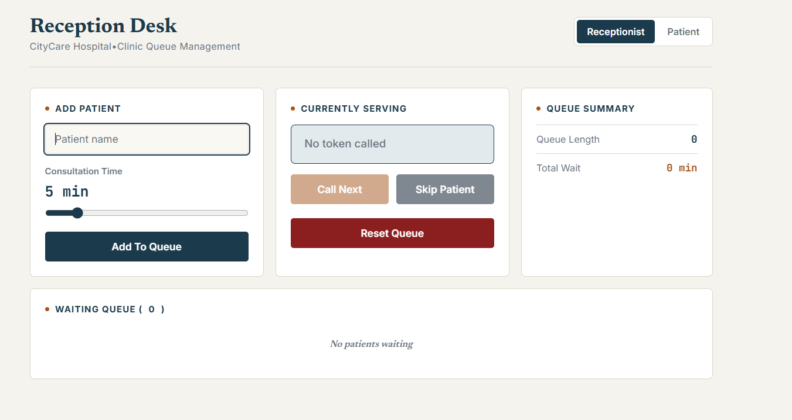
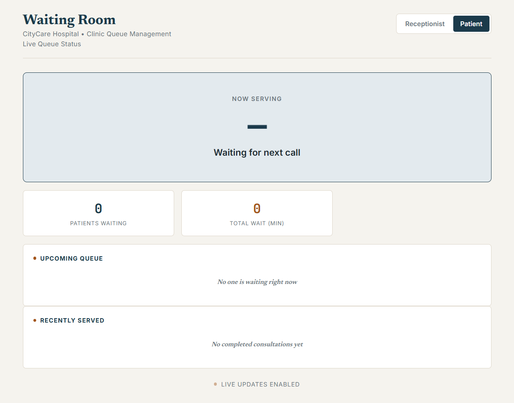
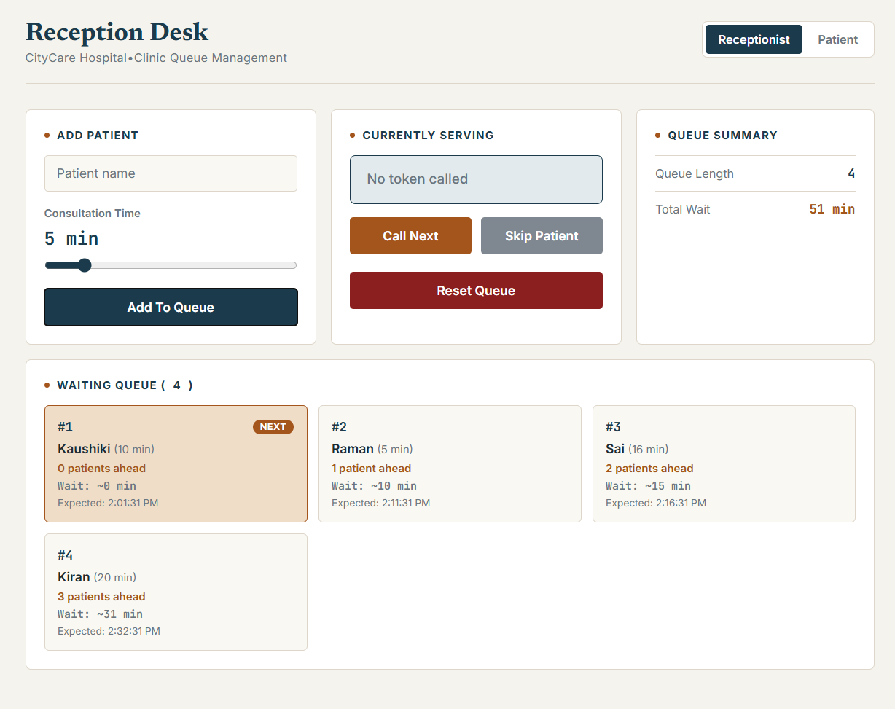
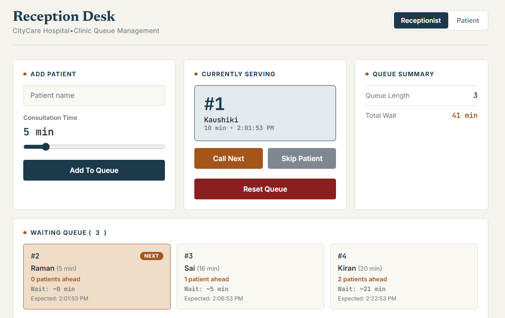
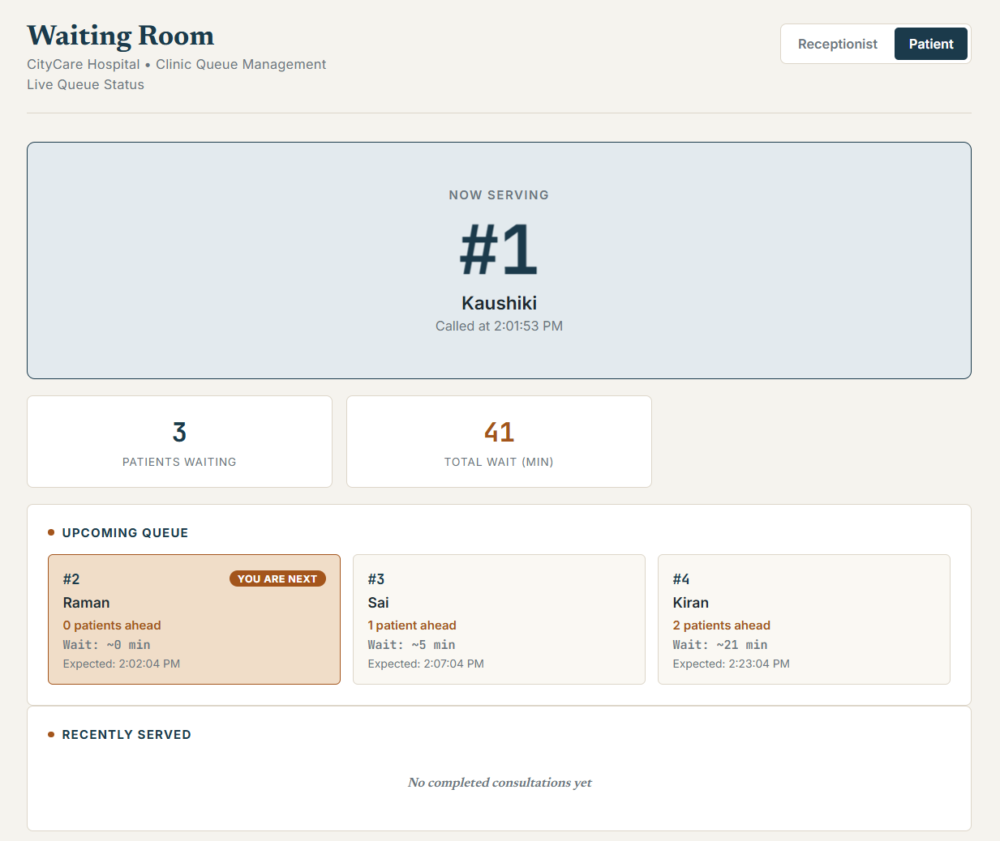
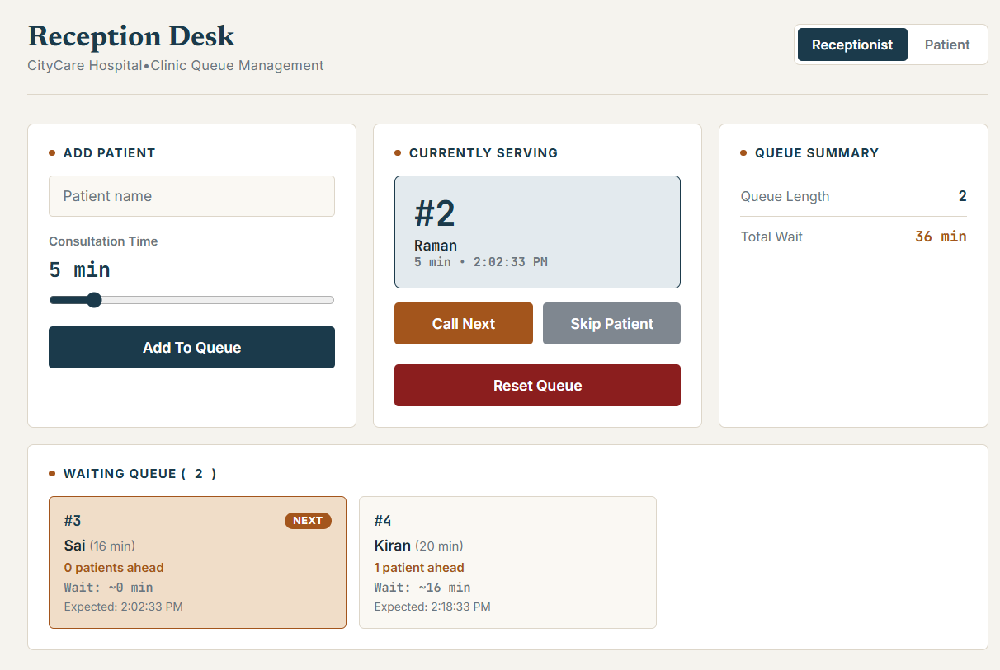
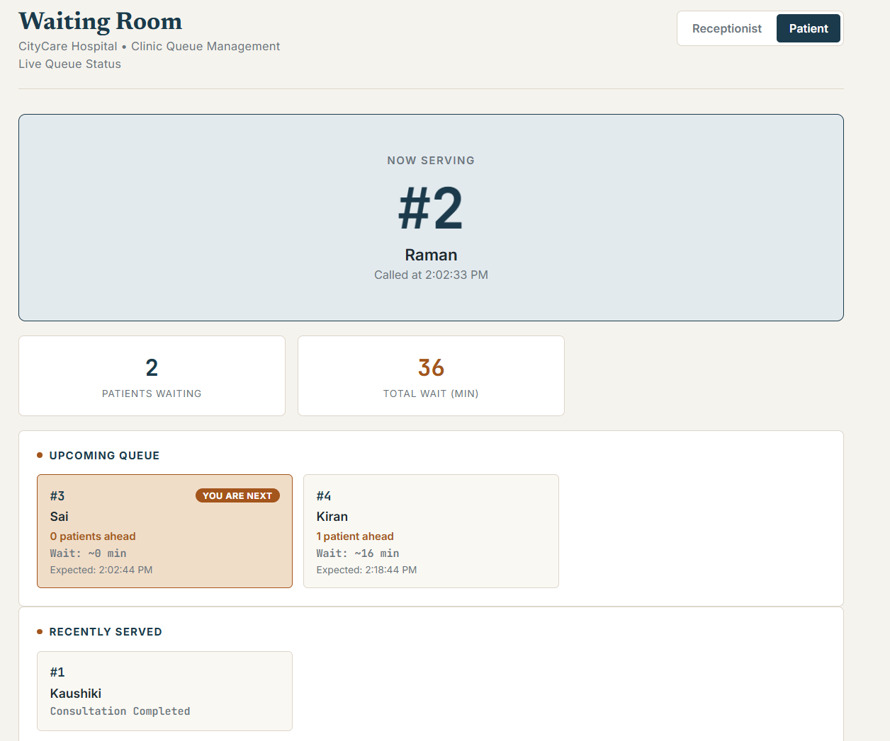

# Queue Cure '26

Real-Time Clinic Queue Management System

Queue Cure is a real-time queue management system built to replace paper token slips and manual patient calling in clinics. It provides a live, synchronized queue visible to both reception staff and patients, removing the guesswork around wait times.

---

## Problem Statement

A large majority of clinics in India still rely on paper tokens and manual calling systems. This creates several recurring problems:

- Patients have no visibility into how long they will wait.
- Receptionists track the queue manually, from memory.
- There is no shared, centralized view of who is being served and who is next.
- Long, unclear waiting periods cause frustration for everyone involved.

Queue Cure addresses this by giving both reception staff and patients a live, shared view of the queue that updates instantly, with no manual refresh required.

---

## Solution

Queue Cure provides two synchronized interfaces, both updating in real time through the same backend.

### Receptionist Dashboard
- Add a patient to the queue with a name and an expected consultation time
- Call the next patient
- Skip the current patient if needed
- Reset the queue back to an empty state
- View a live summary of queue length and total wait time

### Patient Waiting Room
- See which token is currently being served
- See their own position and how many patients are ahead
- See a live, calculated estimated wait time
- See an expected call time
- View recently completed consultations
- All of the above update automatically, without refreshing the page

---

## Screenshots

### Receptionist Dashboard — Empty Queue

### Waiting Room — Empty Queue

### Receptionist Dashboard — Active Queue

### Receptionist Dashboard — Currently Serving a Patient

### Waiting Room — Currently Serving a Patient

### Receptionist Dashboard — Queue Progressing

### Waiting Room — Recently Served History

---

## Key Features

**Real-time synchronization.** Built with Socket.IO, so any action taken on the receptionist screen reflects instantly on the patient screen, with no polling or manual refresh.

**Automatic token generation.** Each patient added to the queue receives a sequential token number automatically.

**Dynamic wait-time calculation.** Wait time for each patient is calculated as the sum of the consultation durations of everyone ahead of them in the queue, not a flat average. This produces a more realistic estimate, since a follow-up visit and a first-time diagnosis do not take the same amount of time.

**Patients-ahead indicator.** Each patient can see exactly how many people are ahead of them, in addition to their estimated wait time.

**Expected call time.** In addition to a relative wait time in minutes, the system calculates an estimated clock time for when a patient is likely to be called.

**Skip patient support.** If a patient cannot be reached or steps away, the receptionist can skip them and move to the next patient without losing queue order.

**Queue reset.** The receptionist can clear the entire queue, current patient, and history, and restart token numbering from one. This is intended for starting a new day or a fresh testing session.

**Queue persistence.** The current queue state is saved to a local JSON file and automatically restored if the server restarts, so an unexpected restart does not lose the current queue.

**Recently served history.** The waiting room displays the most recently completed consultations, giving patients a sense of progress.

---

## System Architecture

Receptionist Dashboard

|

| socket event (add-patient, call-next, skip-patient, reset-queue)

v

Node.js + Express Server (Socket.IO)

|

| single shared queue state, updated server-side

v

state-update broadcast

|

v

Patient Waiting Room

The server is the single source of truth for the queue. Neither screen calculates anything locally — both simply render whatever state the server broadcasts. This is also what prevents race conditions: Node.js processes one socket event at a time, so two near-simultaneous actions (for example, two "Call Next" clicks) cannot corrupt the queue.

---

## Tech Stack

**Frontend:** HTML5, CSS3, vanilla JavaScript

**Backend:** Node.js, Express.js, Socket.IO

**Storage:** JSON file persistence (`queue.json`)

**Deployment:** Render

---

## Wait-Time Calculation Logic

Example:

| Patient | Consultation Time |
|---|---|
| A | 5 min |
| B | 10 min |
| C | 8 min |

Resulting estimated wait times:

| Patient | Estimated Wait |
|---|---|
| A | 0 min |
| B | 5 min |
| C | 15 min |

Formula:
Estimated wait time for a patient = sum of consultation times of every patient ahead of them in the queue

This is recalculated from scratch every time the queue changes — it is never a hardcoded or static number.

---

## Socket Event Diagram

### Add Patient
Receptionist -> add-patient -> Server -> state-update -> All connected clients

### Call Next
Receptionist -> call-next -> Server -> state-update -> All connected clients

### Skip Patient
Receptionist -> skip-patient -> Server -> state-update -> All connected clients

### Reset Queue
Receptionist -> reset-queue -> Server -> state-update -> All connected clients

In every case, the server is the only one that mutates state. Clients only ever send an intent ("add this patient," "call next") and receive the resulting state back — they never compute the queue themselves.

---

## Edge Cases Considered

- Calling "next" when the queue is empty (handled explicitly, does not crash)
- Invalid or missing consultation duration on patient entry (falls back to a default value)
- Multiple clients connected at once (every client receives the same broadcast state)
- Server restart mid-queue (state is persisted to `queue.json` and reloaded on startup)
- Resetting the queue (clears waiting list, current patient, history, and token counter together, so a reset is a genuinely clean slate)
- Two near-simultaneous actions from the receptionist (Node.js processes socket events one at a time, so the queue cannot be corrupted by overlapping calls)

---

## Installation

Clone the repository:
git clone https://github.com/aba2013/queue-cure-26.git

Install dependencies:
npm install

Run the server:
node server.js

Open the receptionist view:
http://localhost:3000/receptionist.html

Open the patient view:
http://localhost:3000/waitingroom.html

---

## Future Improvements

- Support for multiple doctors or consultation rooms running in parallel
- Appointment booking integration
- SMS or WhatsApp notifications when a patient is close to being called
- A proper database instead of file-based persistence
- An analytics dashboard for clinic throughput
- Role-based authentication for receptionist access

---

## License

This project is licensed under the MIT License. See the LICENSE file for details.

---

## Developed For

Queue Cure '26 Hackathon